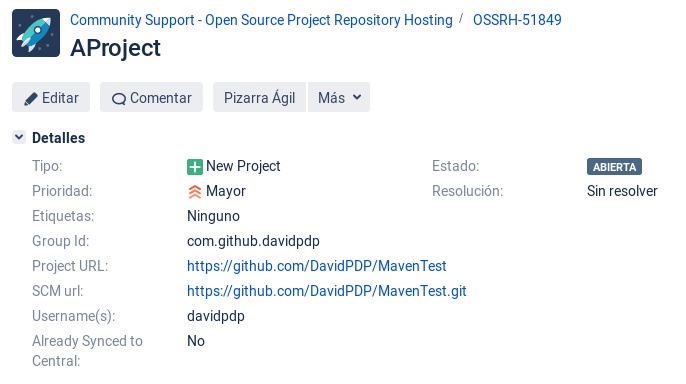
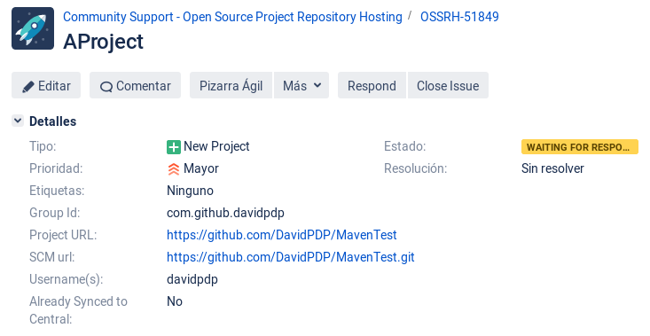
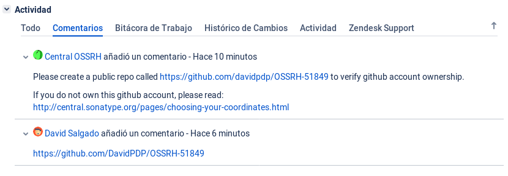
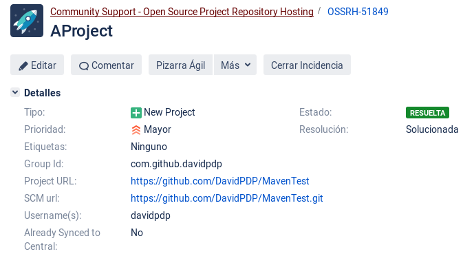
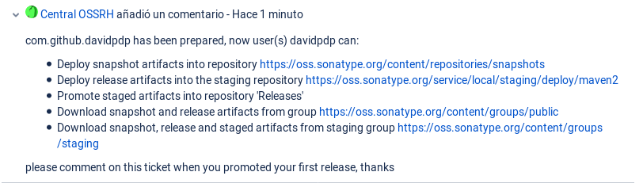
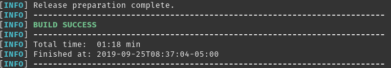

# Tutorial Maven
A continuación, se encuentran los pasos correspondientes para que pueda desplegar su proyecto en el repositorio central de Maven. Asegúrese de cumplir con los requisitos antes de empezar con el tutorial.

**Contenido:**
1. [Requisitos.](#requisitos)
2. [Jira - Sonatype.](#crear-un-ticket-en-jira)
3. [Gen Key.](#generar-llave)
4. [Public Key.](#distribuir-la-llave-pública)
5. [POM.xml.](#configurar-pom)
6. [Ejecutar](#ejecutar-maven)

## Requisitos
 - [x]  Descargar el JDK, Maven, Git, un IDE de preferenica y GnuPG. [Ayuda JDK ](https://www.oracle.com/technetwork/java/javase/downloads/index.html), [Ayuda Maven](https://maven.apache.org/download.cgi), [Ayuda Git](https://git-scm.com/downloads), [Ayuda IDE](https://code.visualstudio.com/), [Ayuda GnuPG](https://www.gnupg.org/download/).
 - [x] Crear una cuenta en un SCM. Se recomienda utilizar una cuenta de Github. [Ayuda.](https://github.com/join)
 - [x] Crear un nuevo repositorio y subir el código que se tenga desarrollado o que se pretende subir al repositorio de Maven. [Ayuda.](https://help.github.com/en/articles/create-a-repo)
 - [x] Agregar una nueva llave SSH al repositorio creado. [Ayuda 1](https://help.github.com/en/enterprise/2.15/user/articles/adding-a-new-ssh-key-to-your-github-account), [Ayuda 2](https://www.youtube.com/watch?v=Vi-WqFKYpnw).

 
## Crear un Ticket en Jira
Primero creamos un *ticket* en Jira en el siguiente [enlace](https://issues.sonatype.org/secure/CreateIssue.jspa?issuetype=21&pid=10134). Debe tener en cuenta que debe esperar hasta que el *ticket* se marque como resuelto.
Cuando se crea debe obtener un resultado parecido al siguiente:

Debe tener en cuenta que le pueden solicitar crear un repositorio u otras actividades para confirmar la propiedad de la cuenta:

Cuando es resuelto el *ticket* debe obtener un resultado parecido al siguiente:

## Generar el Par de Llaves
Para este paso se procede a ejecutar el siguiente comando y a llenar los campos requeridos:

    $ gpg --gen-key
    Nombre y apellidos: David Salgado
    Dirección de correo electrónico: johan.ballesteros@outlook.com
    ¿Cambia (N)ombre, (D)irección o (V)ale/(S)alir? v

Como resultado debería obtener la llave:

    gpg: clave 8F8B03A46E7A13E1 marcada como de confianza absoluta

    gpg: certificado de revocación guardado como '/home/davidsalgado/.gnupg/openpgp-revocs.d/1240010CD207873CA101F8A78F8B03A46E7A13E1.rev'
    claves pública y secreta creadas y firmadas.
    
    pub   rsa3072 2019-09-25 [SC] [caduca: 2021-09-24]
          1240010CD207873CA101F8A78F8B03A46E7A13E1
    uid                      David Salgado <johan.ballesteros@outlook.com>
    sub   rsa3072 2019-09-25 [E] [caduca: 2021-09-24]
    
Una vez generada se deberá firmar cada artefacto de nuestro proyecto, pero evitaremos hacerlo manual y dejaremos que el *plugin* de Maven haga eso por nosotros. Pero además de firmar los artefactos deberemos publicar nuestra llave pública para que los externos puedan validar que efectivamente están descargando los artefactos correctos. 
> **Nota:** Tener en cuenta la caducidad de la llave.

## Distribuir la Llave Pública
Para esto tenemos que saber el id de la llave. Esto lo podemos obtener con el siguiente comando:

    $ gpg --list-keys
    /home/davidsalgado/.gnupg/pubring.kbx
    -------------------------------------
    pub   rsa3072 2019-09-25 [SC] [caduca: 2021-09-24]
      1240010CD207873CA101F8A78F8B03A46E7A13E1
    uid        [  absoluta ] David Salgado <johan.ballesteros@outlook.com>
    sub   rsa3072 2019-09-25 [E] [caduca: 2021-09-24]

El resultado nos muestra la longitud de la llave, la fecha de creación, la fecha de caducidad y el id de la llave que necesitamos. Ahora procedemos a distribuir nuestra llave al servidor de llaves de preferencia en este caso se utilizará pgp.mit.edu, pero existen:

-   pool.sks-keyservers.net
-   gnupg.net:11371
-   keys.pgp.net
-   surfnet.nl

Antes de ejecutar el comando debe pensar en lo siguiente, primero no puede borrar la llave que suba ni renovar el certificado o campos como el correo. Por lo tanto, perder la llave privada significa generar otro par de llaves y realizar nuevamente el proceso. También, al publicar el correo de la llave puede ser blanco de *spammers* por lo que se recomienda utilizar un correo del proyecto y no uno personal.

    $ gpg --keyserver hkp://pgp.mit.edu --send-keys 1240010CD207873CA101F8A78F8B03A46E7A13E1
    gpg: enviando clave 8F8B03A46E7A13E1 a hkp://pgp.mit.edu

Una vez ejecutado este comando debe esperar hasta que se sincronice la llave en los otros servidores esto puede tardar bastante. Para verificar que su llave subió al primer servidor utilice el siguiente comando:

    https://pgp.mit.edu/pks/lookup?op=get&search=0x[ID_llave]
    https://pgp.mit.edu/pks/lookup?op=get&search=0x8F8B03A46E7A13E1
Confirme que coincide la llave encontrada con la que tiene en su equipo. Para revisar la llave de su equipo ejecute el siguiente comando:

    $ gpg --armor --export 8f8b03a46e7a13e1

## Configurar POM
Una vez realizado los anteriores pasos ya estamos listo para subir los artefactos. Para esto se adjunta un archivo [POM](https://github.com/DavidPDP/MavenTest/blob/master/pom.xml). También se debe configurar el archivo settings que se encuentra en el directorio .m2 que crea localmente Maven, remplaza donde estén los corchetes [] eliminandolos y poniendo lo que se solicita.

    <settings>
      <servers>
        <server>
          <id>ossrh</id>
          <username>[jira-username]</username>
          <password>[jira-password]</password>
        </server>
      </servers>
      <profiles>
        <profile>
          <id>ossrh</id>
          <activation>
            <activeByDefault>true</activeByDefault>
          </activation>
          <properties>
            <gpg.passphrase>[gpg-password]</gpg.passphrase>
          </properties>
        </profile>
      </profiles>
    </settings>

## Ejecutar Maven

    $ mvn clean
    $ mvn release:prepare
    What is the release version for "AProject"? (com.github.davidpdp:AProject) 0.0.1: :
    What is SCM release tag or label for "AProject"? (com.github.davidpdp:AProject) AProject-0.1.0: :
    What is the new development version for "AProject"? (com.github.davidpdp:AProject) 0.1.1-SNAPSHOT: :
    

    
    mvn release:perform
    